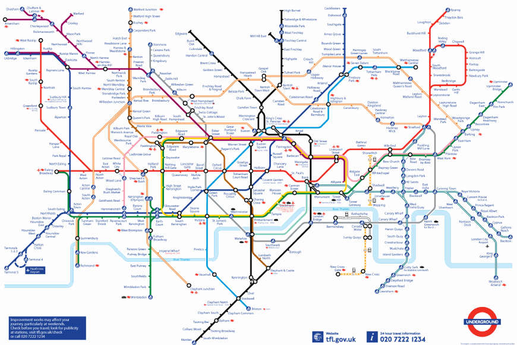
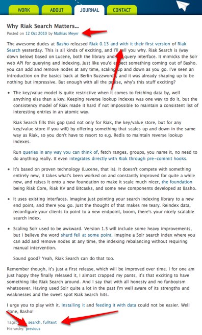
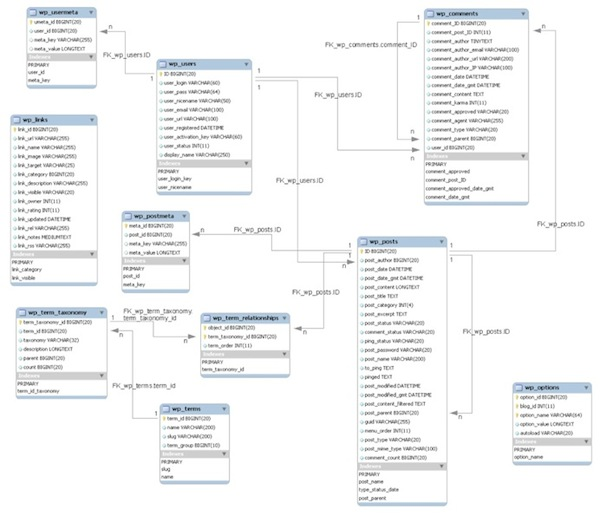

!SLIDE 
# Document Databases in der Cloud #

!SLIDE bullets incremental

# `whoami` #

* Mathias Meyer
* CTO at [Peritor, Berlin](http://peritor.com)
* [@roidrage](http://twitter.com/roidrage)
* <http://paperplanes.de>

!SLIDE bullets incremental

# Agenda #

* Was sind Dokumente?
* Was sind Document-Databases?
* CouchDB

!SLIDE center

# Dokumente? #

!SLIDE bullets incremental

# Dokumente? #

* Ein Tweet
* Ein User
* Ein Word-Dokument
* Eine Email
* Ein Kalender-Eintrag

!SLIDE center

!SLIDE bullets incremental

# Dokumente? #

* In sich abgeschlossene, semi-strukturierte Daten.
* Metadaten inklusive

!SLIDE center

# Metadaten? #

!SLIDE bullets incremental

# Metadaten? #

* Attachments
* Geo-Locations
* Kommentare
* Links, Tags
* View-Counter

!SLIDE center

# Das Web #

!SLIDE

## Das Web ist voll von Dokumenten ##

!SLIDE center

!SLIDE

## Dokumente sind nicht strikt relational ##

!SLIDE

## Dokumente sind (lose) verknüpft ##

!SLIDE bullets incremental

# Document Databases? #

* Gutes Handling von Einzeldokumenten
* Loses Schema
* CouchDB, Riak, MongoDB, RavenDB

!SLIDE center

# Klassisches Schema #

!SLIDE small xml

# Dokumente #
    
    @@@ xml
    <?xml version="1.0"?>
    <document>
      <title>Why Riak Search Matters...</title>
      <content>
        <![CDATA [
          ...
        ]]>
      </content>
    </document>

!SLIDE

# XML-Datenbanken! #

!SLIDE small javascript

# Dokumente #

    @@@ javascript
    {
      "_id": "eb28b751a33d1bf9d7dfffd6700006d5",
      "_rev": "1-6f773089b853fd5f7867562b179a854a",
      "title": "Why Riak Search Matters...",
      "published_at": "2010/10/08 17:00:00 +0000",
      "tags": ["riak", "full text search"]
    }
