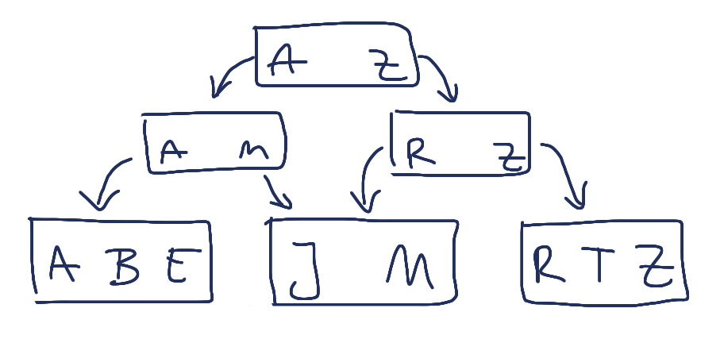

!SLIDE

## ”CouchDB is just a B-Tree and a Transformation Engine.“ ##

<a href="http://twitter.com/bitdiddle/status/19645939355">Anonymous Tweeter</a>

!SLIDE center

# Der B-Tree #

!SLIDE

## Alle Daten werden in einem B-Tree gespeichert. ##

!SLIDE

## Daten werden immer nur angehängt, ##
## niemals aktualisiert. ##

!SLIDE

## Wie kann ich meine Daten abfragen? ##

!SLIDE bullets incremental

* Queries werden als Views gespeichert
* Views werden in JavaScript geschrieben
* Views sind Teil von Design-Dokumenten

!SLIDE bullets incremental

# Views #

* Sind ein B-Tree
* Mapping von Key auf ein Document oder Value

!SLIDE bullets incremental

# Views - Keys #

* Keys können beliebige Objekte sein

!SLIDE

# Views - Keys #

    "Why Riak Search Matters..."

    ["riak", "full text search"]

    {title: "Why Riak...", published_at: ".."}

!SLIDE bullets incremental

# Views - Values #

* Meistens `null`
* Beliebige JSON Objekte
* Werden im View gespeichert

!SLIDE

# Views #

!SLIDE bullets incremental

# Map/Reduce #

!SLIDE bullets incremental

## Map erstellt Keys und Values ##

!SLIDE

## Reduce aggregiert Values ##

!SLIDE 

# Map-Phase #

## Titel als Key ##

    function(doc) {
      emit(doc.title, doc);
    }

!SLIDE javascript

## Tags als Key ##

    function(doc) {
      for (var index in doc.tags) {
        emit(doc.tags[index], 1);
      }
    }

!SLIDE

## Beliebig viele Keys pro Dokument ##

!SLIDE javascript small

## Reduce-Phase für Tags ##

    function(keys, values, rereduce) {
      var sum = 0;
      for (var i = 0; i < values.length; i++) {
         sum += values[i];
      }
      return sum;
    }

!SLIDE bullets incremental

# Design Documents #

* Sammeln Map/Reduce-Funktionen
* Namenskonvention: `_design/<document>`
* JSON Dokument

!SLIDE javascript small

# Design Documents #

    {
      "_id": "_design/posts"
      "views": {
        "by_name": {
          "map": "function(doc)...",
          "reduce": "function(keys, values, rereduce)"
        }
      }
    }

!SLIDE smaller

## Views abfragen ##

    /powerdays/_design/posts/_view/by_title?
       key="Why Riak Search Matters..."

!SLIDE bullets incremental

# Views #

* Update nur beim Abfragen
* Lesen immer von Disk
* Invalide wenn Design-Dokumente aktualisiert werden
