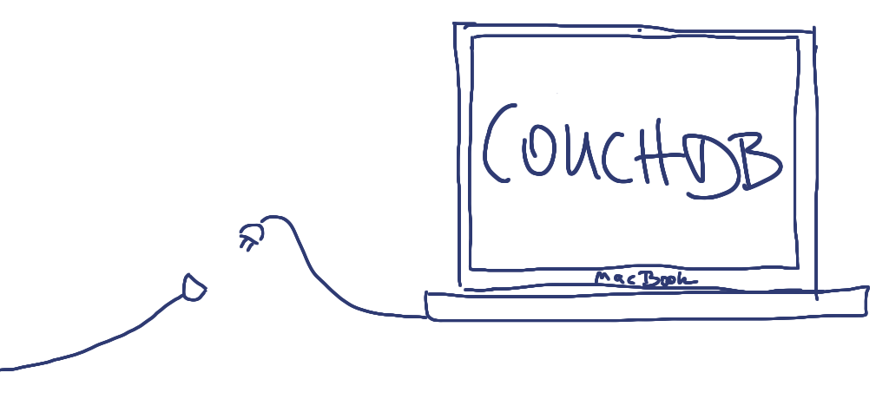

!SLIDE

## ”Localhost is local most.“ ##

Mario Scheliga

!SLIDE center

## CouchDB ist Offline ##

!SLIDE bullets incremental

## Läuft auf ##

* Laptop
* Handy
* Server
* Cloud™

!SLIDE center

## Repliziert und synchronisiert ##
## zwischen allen. ##

!SLIDE bullets incremental

# P2P Replikation #

* Repliziere jede Datenbank
* Von und mit jeder Datenbank
* Zu jeder Zeit

!SLIDE bullets incremental

## Daten können gefiltert werden. ##

* *mit JavaScript
